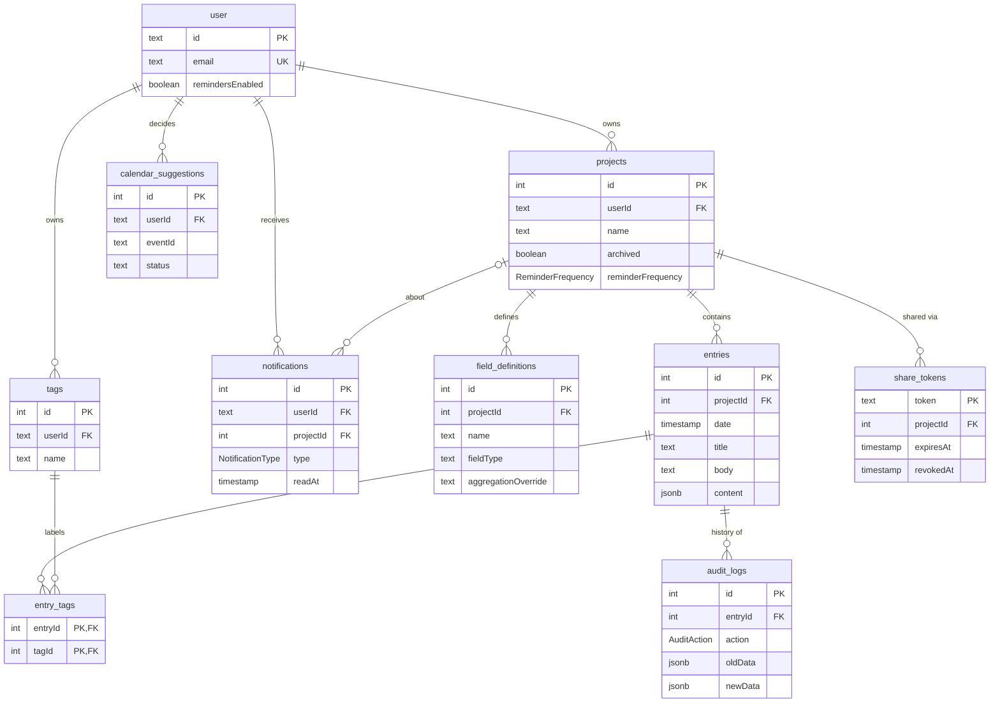

import AiDeclaration from '@site/src/components/AiDeclaration';

# Database Design

## Overview

The UniLogs database supports users, projects, custom field definitions,
entries, tags, entry history, calendar suggestions, share links and
notifications. Users can give each project its own entry format, and existing
entries are kept when that format changes.

It has **thirteen tables**. Four are required by Better Auth (`user`,
`session`, `account` and `verification`). The other nine belong to UniLogs:
`projects`, `field_definitions`, `entries`, `tags`, `entry_tags`,
`audit_logs`, `calendar_suggestions`, `share_tokens` and `notifications`.

Column names below are the real names in the database. Prisma keeps the
camelCase field names from `backend/prisma/schema.prisma`, and `@@map` only
renames the tables.

## Entity Relationship Diagram

Drawn from `backend/prisma/schema.prisma`. The Better Auth tables `session`,
`account` and `verification` are left out for readability; each of the first
two belongs to one `user`.

Original Sprint 1 diagram

The diagram from the Sprint 1 design, kept for reference. It predates tags
belonging to users, entry titles and bodies, share links, reminders and
notifications.

## Tables

### User

The `user` table stores user accounts. Its structure follows the schema
Better Auth requires, plus one UniLogs column.

| Column             | Type      | Constraints              |
| ------------------ | --------- | ------------------------ |
| `id`               | text      | Primary key              |
| `name`             | text      | Not null                 |
| `email`            | text      | Not null, unique         |
| `emailVerified`    | boolean   | Not null, default false  |
| `image`            | text      |                          |
| `createdAt`        | timestamp | Not null                 |
| `updatedAt`        | timestamp | Not null                 |
| `remindersEnabled` | boolean   | Not null, default `true` |

`remindersEnabled` is the account-wide switch in **Settings**. When it is off,
the reminder scheduler skips all of the user's projects.

### Session

The `session` table stores active login sessions issued by Better Auth. Each
session belongs to one user and carries the token read from the session cookie
on every request.

| Column      | Type      | Constraints                        |
| ----------- | --------- | ---------------------------------- |
| `id`        | text      | Primary key                        |
| `expiresAt` | timestamp | Not null                           |
| `token`     | text      | Not null, unique                   |
| `createdAt` | timestamp | Not null                           |
| `updatedAt` | timestamp | Not null                           |
| `ipAddress` | text      |                                    |
| `userAgent` | text      |                                    |
| `userId`    | text      | Not null, foreign key to `user.id` |

### Account

The `account` table stores the credentials and provider tokens Better Auth uses
to authenticate a user: a password hash for email/password sign-in, or OAuth
tokens for Google. A user can have more than one linked account. `scope`
records which Google permissions were granted, which is how the API knows
whether Google Calendar has been connected.

| Column                  | Type      | Constraints                        |
| ----------------------- | --------- | ---------------------------------- |
| `id`                    | text      | Primary key                        |
| `accountId`             | text      | Not null                           |
| `providerId`            | text      | Not null                           |
| `userId`                | text      | Not null, foreign key to `user.id` |
| `accessToken`           | text      |                                    |
| `refreshToken`          | text      |                                    |
| `idToken`               | text      |                                    |
| `accessTokenExpiresAt`  | timestamp |                                    |
| `refreshTokenExpiresAt` | timestamp |                                    |
| `scope`                 | text      |                                    |
| `password`              | text      |                                    |
| `createdAt`             | timestamp | Not null                           |
| `updatedAt`             | timestamp | Not null                           |

### Verification

The `verification` table stores short-lived tokens used for email verification
and password reset.

| Column       | Type      | Constraints |
| ------------ | --------- | ----------- |
| `id`         | text      | Primary key |
| `identifier` | text      | Not null    |
| `value`      | text      | Not null    |
| `expiresAt`  | timestamp | Not null    |
| `createdAt`  | timestamp | Not null    |
| `updatedAt`  | timestamp | Not null    |

### Projects

The `projects` table stores the projects users create. Each project belongs to
one user and holds its field definitions and entries.

| Column              | Type                | Constraints                        |
| ------------------- | ------------------- | ---------------------------------- |
| `id`                | integer             | Primary key                        |
| `name`              | text                | Not null                           |
| `description`       | text                |                                    |
| `archived`          | boolean             | Not null, default `false`          |
| `reminderFrequency` | `ReminderFrequency` | Not null, default `WEEKLY`         |
| `lastDigestSentAt`  | timestamp           |                                    |
| `userId`            | text                | Not null, foreign key to `user.id` |

`archived` lets a user retire a project without losing its entries. Archived
projects are hidden from the default project list but stay intact and can be
unarchived. `reminderFrequency` is chosen during project creation.
`lastDigestSentAt` stops the hourly reminder sweep from emailing about the same
quiet project more than once per period.

### Field definitions

The `field_definitions` table stores the custom fields that define the format
of entries in a project.

| Column                | Type    | Constraints                            |
| --------------------- | ------- | -------------------------------------- |
| `id`                  | integer | Primary key                            |
| `projectId`           | integer | Not null, foreign key to `projects.id` |
| `name`                | text    | Not null                               |
| `fieldType`           | text    | Not null                               |
| `aggregationOverride` | text    | `sum`, `average`, `max`, `min` or null |

`fieldType` is one of `text`, `number`, `duration`, `boolean` (shown as
"Toggle" in the app) or `date`. `aggregationOverride` lets a user choose how a
numeric field is summarised in the project's statistics. When it is null,
UniLogs picks a sensible default for the field type.

### Entries

The `entries` table stores the logbook entries themselves. Each entry belongs
to a project and stores its custom field values as JSON.

| Column      | Type      | Constraints                            |
| ----------- | --------- | -------------------------------------- |
| `id`        | integer   | Primary key                            |
| `projectId` | integer   | Not null, foreign key to `projects.id` |
| `date`      | timestamp | Not null                               |
| `createdAt` | timestamp | Not null, default now                  |
| `content`   | jsonb     | Not null                               |
| `title`     | text      |                                        |
| `body`      | text      | Markdown                               |

An entry must have at least one of a title, a body or a field value. The API
rejects wholly empty entries.

### Tags

The `tags` table stores labels that can be attached to entries. Tags belong to
a user, so two users can each have a tag called "exam prep" without sharing it.

| Column   | Type    | Constraints                        |
| -------- | ------- | ---------------------------------- |
| `id`     | integer | Primary key                        |
| `name`   | text    | Not null                           |
| `userId` | text    | Not null, foreign key to `user.id` |

The combination of `userId` and `name` is unique, so a user can't create the
same tag twice.

### Entry_tags

The `entry_tags` table is a junction table that connects entries and tags,
giving a many-to-many relationship.

| Column    | Type    | Constraints                           |
| --------- | ------- | ------------------------------------- |
| `entryId` | integer | Not null, foreign key to `entries.id` |
| `tagId`   | integer | Not null, foreign key to `tags.id`    |

`entryId` and `tagId` together form the primary key, so the same tag can't be
attached to the same entry twice.

### Audit_logs

The `audit_logs` table stores the history of changes to entries. Each change
creates a record of the action and the data before and after it.

| Column       | Type          | Constraints                           |
| ------------ | ------------- | ------------------------------------- |
| `id`         | integer       | Primary key                           |
| `entryId`    | integer       | Not null, foreign key to `entries.id` |
| `action`     | `AuditAction` | Not null                              |
| `oldData`    | jsonb         |                                       |
| `newData`    | jsonb         |                                       |
| `modifiedAt` | timestamp     | Not null, default now                 |

### Calendar_suggestions

The `calendar_suggestions` table records what a user has already decided about
a Google Calendar event offered as a possible entry, so the same event isn't
suggested again after being accepted or dismissed.

| Column      | Type      | Constraints                         |
| ----------- | --------- | ----------------------------------- |
| `id`        | integer   | Primary key                         |
| `userId`    | text      | Not null, foreign key to `user.id`  |
| `eventId`   | text      | Not null                            |
| `status`    | text      | Not null (`ACCEPTED` or `REJECTED`) |
| `createdAt` | timestamp | Not null, default now               |

The combination of `userId` and `eventId` is unique, so deciding on the same
event twice is rejected by the database rather than relying on application
code to catch it.

### Share_tokens

The `share_tokens` table stores the read-only report links a user creates for
a project. The token itself is the primary key and appears in the link
(`/r/{token}` in the app, `/share/{token}` in the API).

| Column             | Type      | Constraints                            |
| ------------------ | --------- | -------------------------------------- |
| `token`            | text      | Primary key                            |
| `projectId`        | integer   | Not null, foreign key to `projects.id` |
| `expiresAt`        | timestamp | Not null                               |
| `revokedAt`        | timestamp |                                        |
| `includeBodies`    | boolean   | Not null, default `false`              |
| `defaultRangeDays` | integer   | Not null, default `30`                 |
| `createdAt`        | timestamp | Not null, default now                  |

A link works only while it is unexpired and `revokedAt` is null. Revoking sets
`revokedAt` instead of deleting the row, so a revoked link can never start
working again by accident. `includeBodies` decides whether the public report
shows entry text or only titles and fields.

### Notifications

The `notifications` table stores the in-app notification feed shown under the
bell.

| Column      | Type               | Constraints                        |
| ----------- | ------------------ | ---------------------------------- |
| `id`        | integer            | Primary key                        |
| `userId`    | text               | Not null, foreign key to `user.id` |
| `projectId` | integer            | Foreign key to `projects.id`       |
| `type`      | `NotificationType` | Not null                           |
| `title`     | text               | Not null                           |
| `body`      | text               | Not null                           |
| `readAt`    | timestamp          |                                    |
| `createdAt` | timestamp          | Not null, default now              |

`projectId` is optional because not every notification is about a project.
`readAt` is null until the user reads it.

## Enums

| Enum                | Values                       | Used by                                                                         |
| ------------------- | ---------------------------- | ------------------------------------------------------------------------------- |
| `AuditAction`       | `CREATE`, `UPDATE`, `DELETE` | `audit_logs.action`: whether the entry was created, modified or deleted         |
| `ReminderFrequency` | `DAILY`, `WEEKLY`, `OFF`     | `projects.reminderFrequency`: how long a project can go quiet before a reminder |
| `NotificationType`  | `REMINDER`, `SYSTEM`         | `notifications.type`: a reminder about a quiet project, or a general message    |

## Indexes

Beyond primary keys and unique constraints, these indexes back the most common
queries. See [Performance](/performance) for the measurements behind them.

| Index                              | Speeds up                                        |
| ---------------------------------- | ------------------------------------------------ |
| `projects(userId)`                 | Listing a user's projects                        |
| `field_definitions(projectId)`     | Loading a project's fields                       |
| `entries(projectId)`               | Loading a project's entries                      |
| `entries(date)`                    | Date-range filters, the heatmap and streaks      |
| `entry_tags(tagId)`                | Filtering entries by tag                         |
| `share_tokens(projectId)`          | Listing a project's share links                  |
| `notifications(userId, createdAt)` | Loading a user's notification feed, newest first |

## Relationships

- One user has many sessions and many accounts (one per linked sign-in method,
  such as email/password or Google).
- One user has many projects, tags, notifications and calendar suggestion
  records.
- One project has many field definitions, entries, share tokens and
  notifications.
- One entry has many tags, and one tag belongs to many entries, through the
  `entry_tags` junction table.
- One entry has many audit log records, so changes to an entry are tracked over
  time.
- Deleting a user or project deletes everything that belongs to it (cascading
  deletes), so nothing is left orphaned.

## Design Decisions

### Better Auth User Schema

The `user`, `session`, `account` and `verification` tables follow the schema
Better Auth requires, so sessions, linked sign-in providers and verification
tokens work with the authentication library unchanged.

### Dynamic Entry Content

The `content` column in `entries` uses `jsonb` to hold custom field values.
Each project defines different fields, so the database can't have a fixed
column for every possible field. The API validates `content` against the
project's field definitions before saving it.

### Title and Body as Real Columns

Entry titles and bodies were added in Sprint 3 as real columns rather than as
more keys in `content`. Every entry has them regardless of project, and search
needs to match them directly. User testing had shown free-text notes weren't
discoverable when they depended on adding a custom field.

### Required Entry Date

`date` is required so every entry has a known date. Timelines, statistics and
streaks all depend on it.

### Many-to-Many Tags

The `entry_tags` junction table gives entries and tags a many-to-many
relationship, and its composite primary key prevents duplicate tag
assignments.

### Audit History

`audit_logs` keeps the history of changes to entries by storing the action,
the previous data and the new data. The brief asks for "a record of what they
do", and a record that can be silently rewritten is a weaker one.

### Calendar Suggestion Status

`calendar_suggestions.status` is plain text rather than a Postgres enum like
`AuditAction`. The only values today are `ACCEPTED` and `REJECTED`, but this
table only remembers a per-user, per-event decision. Nothing joins or filters
on `status` in a way that benefits from database-level validation, so plain
text avoids a migration if a new status (for example "snoozed") is added.

### Share Tokens as Their Own Table

Share links could have been a column on `projects`. A separate table lets a
project have several links, each with its own expiry, and lets each one be
revoked on its own without affecting the others.

### Proposed, Not Yet Built: Tasks

`schema.prisma` also contains a `Task` model (title, notes, due date,
completed), proposed for standalone to-do items in a project. It has **no
migration**, so the `tasks` table doesn't exist in any database, and no API
route uses it. The "What's left" feature currently works from to-do fields on
entries instead. `Task` is documented here so its presence in the schema isn't
mistaken for a finished feature.

## Deployment

The database is **PostgreSQL on [Neon](https://neon.tech)**, a managed,
serverless Postgres provider. Nobody on the team installs or administers a
local Postgres server — see `tech-stack.mdx` for why Neon specifically was
chosen over a self-hosted database.

### Environments

Three separate databases exist, and the team never lets them mix:

- **Production** — a Neon branch whose connection string lives only in
  Render's environment variables. It is never checked out to a developer
  machine and never committed anywhere in this repository.
- **Development** — a separate Neon branch, referenced by each developer's own
  local `backend/.env` (`DATABASE_URL`). Neon's branching feature means this
  can be reset from production data, or from a clean schema, without touching
  production itself.
- **Test** — a disposable Postgres instance, run locally via Docker
  (`backend/docker-compose.test.yml`) or, in CI, a fresh
  `postgres:16-alpine` service container created for every run and discarded
  afterwards. This is deliberate: automated tests create and delete real
  rows, so they must never be able to reach the development or production
  database. `backend/vitest.config.ts` refuses to run the suite unless
  `TEST_DATABASE_URL` points at a database with `test` in its name, as a
  guard against pointing it at the wrong environment by mistake.

### Migrations

Schema changes are managed entirely through Prisma Migrate, so every change is
a versioned, checked-in SQL file under `backend/prisma/migrations/` rather
than a manual change made directly against a database:

- `npx prisma migrate dev` — used locally to create a new migration from a
  schema change and apply it to the developer's own dev database.
- `npx prisma migrate deploy` — a non-interactive apply, used in CI (against
  the disposable test database) and for deploying to production. It only
  applies migrations that don't already exist; it never generates new ones.

Migration files are never hand-edited once committed — a mistake in an
already-applied migration is corrected with a new migration, not a rewrite of
history, so that every environment's migration history stays identical and
replayable.

<AiDeclaration
  action="generated"
  tools="ChatGPT[GPT-5.6 Luna], Claude-Code[Claude Sonnet 5], Claude-Code[Claude Opus 5.5]"
  purpose="drafting and structuring the database design documentation, and updating it to cover the projects table's description/archived columns, the calendar_suggestions table and database deployment, then bringing every table up to date with the Sprint 3 schema (share tokens, notifications, reminders, entry title and body), correcting column names and adding a Mermaid ERD"
/>
